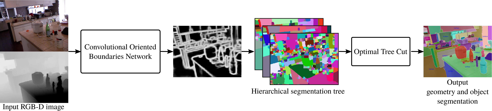

# SceneCut: Joint Geometric and Object Segmentation for Indoor Scenes

### Update:
  
### Prerequisites:

### Usage
- Run demo.m
 
### Citation:
If you use this code, please consider citing the following papers:
@Inproceedings{Pham2017,
   author = {{Pham}, T. and {Do}, T.-T. and {S{\"u}nderhauf}, N. and {Reid}, I.
	},
    title = "{SceneCut: Joint Geometric and Object Segmentation for Indoor Scenes}",
    booktitle={2018 IEEE International Conference on Robotics and Automation (ICRA)}, 
    year={2018}, 
}
	
If you encounter any problems with the code, please contact the first author.

Enjoy!